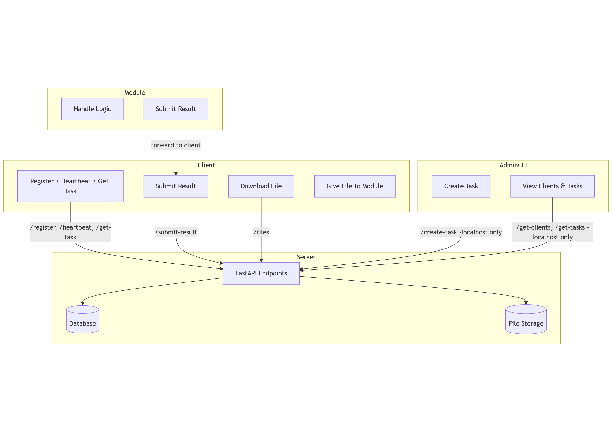

# The-PEER-Project
Distributed computing project designed to share the resources of volunteers to achieve otherwise infeasible goals. Currently only the skeleton of the project has been laid out as a proof of concept. Stay tuned for updates!

## How it works 
Volunteers download the client program and run it.  
Based on their installed modules the client grabs a task from the server.  
The client completes the task and sends the result back to the server.  
The server assembles all of the completed data into something useable. The end result depends on what the goal of the module is.  
Modules will be created based off of interest of contributors.  
Anyone is welcome to create a new module. All modules will be reviewed before being accepted.

## To do list 
- Add security  
- Implement a queue system
- Expand on client program
- Give admin cli more features  
- Module example
- Documentation
- file hosting  

## Interaction Map

## Resources
Here are links for some of the frameworks/tools this project uses.  
[FastAPI](https://fastapi.tiangolo.com/)  
[SQLAlchemy](https://www.sqlalchemy.org/)  
[Pydantic](https://docs.pydantic.dev/latest/)  
[Requests](https://requests.readthedocs.io/en/latest/user/quickstart/)  

## Making your own module  
There are a couple things to keep in mind when creating a module.
1. How easily can your workload be divided up?  
2. Think about the data that your module will need to function. How easily can we distribute out that data as tasks?    
3. The task data will be passed to your module as json. You will need to handle parsing it into your languages native data structure (Python: dict, Java: hashmap, etc)  
4. The result must be sent to stdout as a json string.  
5. The main client program captures anything sent to stdout so if you need to print anything other than the result to the console make sure you are sending it to stderr.    
6. If you have more questions reach out me