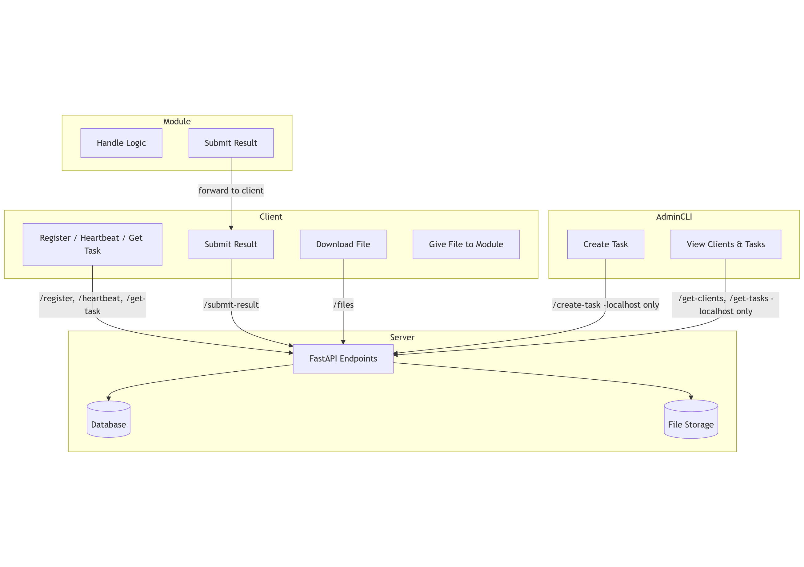

# The-PEER-Project
Distributed computing project designed to share the resources of volunteers to achieve otherwise infeasible goals. Stay tuned for updates!  

## How it works 
Volunteers download the client program and run it.  
Based on their installed modules the client grabs a task from the server.  
The client completes the task and sends the result back to the server.  
The server assembles all of the completed data into something useable. The end result depends on what the goal of the module is.  
Modules will be created based off of interest of contributors.  
Anyone is welcome to create a new module. All modules will be reviewed before being accepted.

## To do list   
- Replace current schemas  
- Clean up admin cli    
- Testing  
- Documentation
- Lots of refactoring   

## Interaction Map

## Resources
Here are links for some of the frameworks/tools this project uses.  
[FastAPI](https://fastapi.tiangolo.com/)  
[SQLAlchemy](https://www.sqlalchemy.org/)  
[Pydantic](https://docs.pydantic.dev/latest/)  
[Requests](https://requests.readthedocs.io/en/latest/user/quickstart/)  

## Making your own module  
There are a couple things to keep in mind when creating a module.
1. How easily can your workload be divided up?  
2.  What would be a good batch size for your workload? How long should it take on average to complete a batch?  
3. Think about the data that your module will need to function.   
4. Refer to the [module guide](docs/module_guide.md) for guidelines on formatting  